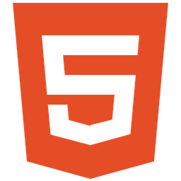

<h1 align="center">Hello👋, I'm Armando Salazar</h1>
<h3 align="center">Full Stack Developer</h3>

### About me 

I'm a software geek with a knack for coding, design, and all things Agile (especially Scrum). Whether I'm diving into new projects or tinkering with existing code, I bring a blend of creativity and attention to detail. You'll often find me lost in the world of debugging, crafting error-free solutions while sipping on copious amounts of coffee. I'm on the lookout for a fun tech company where I can unleash my coding wizardry and be part of something awesome.

**💻Tech stack at work:**
<table>
  <thead>
    <tr>
      <th>Frontend</th>
      <th>Backend</th>
      <th>Tools & DevOps</th>
      <th>Database</th>
    </tr>
  </thead>
  <tbody>
    <tr>
      <td align="center">
        
        
      </td>
      <td align="center">
        
        
        
        
      </td>
      <td align="center">
        
        
        
        
      </td>
      <td align="center">
        
      </td>
    </tr>
  </tbody>
</table>

### Skills

#### Frontend

#### Backend

#### Tools & DevOps

#### Databases

#### Contact me
Find all of my social media profiles and my resume on my [website](https://armandosj.github.io/)

