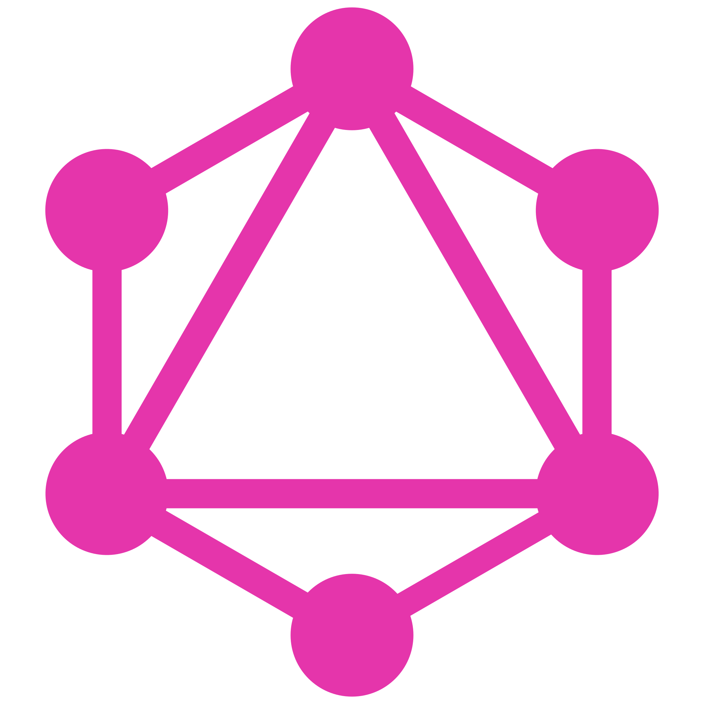

<h1 align="center">Hello👋, I'm Armando Salazar</h1>

### About me

I'm a full‑stack developer passionate about building meaningful applications and writing clean, maintainable code. Experienced in both frontend and backend development, with a constant drive to learn new technologies and improve existing solutions.

**💻Tech stack at work:**

<table align="start">
  <tr>
    <td align="center">
      <h3>Frontend</h3>
      

        
      

    </td>
    <td align="center">
      <h3>Backend</h3>
      

        
        
        
      

    </td>
    <td align="center">
      <h3>Tools & DevOps</h3>
      

        
        
        
        
      

    </td>
    <td align="center">
      <h3>Database</h3>
      

        
      

    </td>
  </tr>
</table>

**💻Skills**

<table align="start">
  <tr>
    <td align="center">
      <h3>Frontend</h3>
      

        
        
        
        
        
      

    </td>
    <td align="center">
      <h3>Backend</h3>
      

        
        
        
        
    </td>
  </tr>
  <tr>
    <td align="center">
      <h3>Databases</h3>
      

        
        
        
        
      

    </td>
    <td align="center">
      <h3>DevOps & Tools</h3>
      

        
        
        
        
        
      

    </td>
  </tr>
</table>

**💻Current Focus**
<table align="start">
  <tr>
    <td align="center" colspan="2">
      

        
        
        
        
      

    </td>
  </tr>
</table>

📫 Feel free to explore my projects or connect with me for collaboration or professional opportunities find all of my social media profiles and my resume on my [profile](https://armandosj.github.io/)

